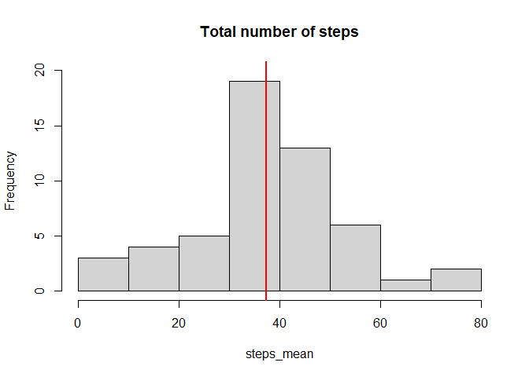
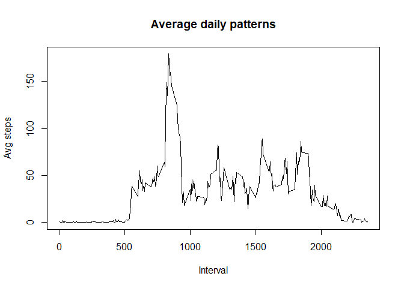
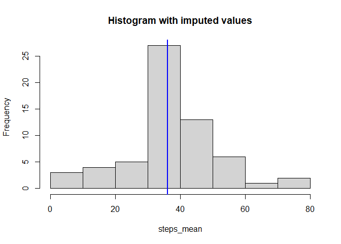
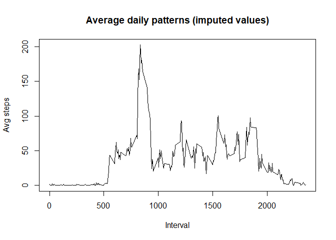
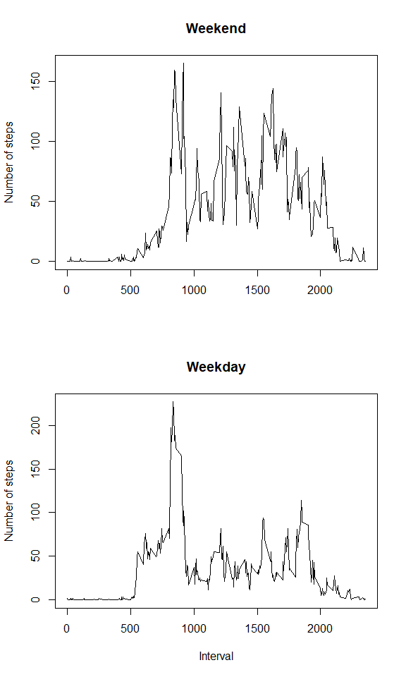

#### Loading and pre processing the data


```r
data = read.csv("activity.csv", header = T)
data$date = as.Date(data$date, format = "%Y-%m-%d")
head(data,10)
```

```
##    steps       date interval
## 1     NA 2012-10-01        0
## 2     NA 2012-10-01        5
## 3     NA 2012-10-01       10
## 4     NA 2012-10-01       15
## 5     NA 2012-10-01       20
## 6     NA 2012-10-01       25
## 7     NA 2012-10-01       30
## 8     NA 2012-10-01       35
## 9     NA 2012-10-01       40
## 10    NA 2012-10-01       45
```

#### What is mean total number of steps taken per day?


```r
steps_mean = tapply(data$steps, data$date ,FUN = mean, na.rm =T)
med = median(steps_mean, na.rm =TRUE)

{hist(steps_mean, ylim=c(0,20), main="Total number of steps") 
abline(v=med, col='red', lw=2)

}
```

<!-- -->


#### What is the average daily activity pattern?


```r
interval = tapply(data$steps, list(data$date, data$interval), sum, na.rm=T)

avg = round(colMeans(interval, na.rm = T),2)

plot(names(avg),avg, type = 'l', main="Average daily patterns", xlab="Interval", ylab="Avg steps")
```

<!-- -->


#### Imputing missing values  


```r
interval = tapply(data$steps, list(data$date, data$interval), sum, na.rm=T)
mean_interval = colMeans(interval)

data_inp = data

for(n in 1:length(colnames(interval))){
  col = colnames(interval) [n] 
  na_index = is.na(data_inp$steps) & data_inp[,3]==as.integer(col)

  data_inp[na_index, 1] =  mean_interval[[col]]
}

steps_mean = tapply(data_inp$steps, data_inp$date , FUN = mean, na.rm =T)
med = median(steps_mean, na.rm =TRUE)

{hist(steps_mean, main="Histogram with imputed values") 
abline(v=med, col='blue', lw=2)}
```

<!-- -->

```r
#----

interval = tapply(data_inp$steps, list(data_inp$date, data_inp$interval), sum)

for(n in 1:length(colnames(interval))){
  col = colnames(interval) [n] 
  na_index = is.na(interval[, col])
  interval[na_index, col] =  mean_interval[[col]]
}

avg = round(colMeans(interval, na.rm = T),2)
plot(names(avg),avg, type = 'l', main="Average daily patterns (imputed values)", xlab="Interval", ylab="Avg steps")
```

<!-- -->


#### Are there differences in activity patterns between weekdays and weekends?  


```r
weekend = function(date){
  return(weekdays(date) %in% c("Saturday", "Sunday"))
}

data_inp$weekend = as.factor( weekend(data_inp$date))
```


```r
{
par(mfrow=c(2,1))

data_inp_weekend = data_inp$weekend=="TRUE"
data_inp_weekend = data_inp[data_inp_weekend,]

interval = tapply(data_inp_weekend$steps, list(data_inp_weekend$date, data_inp_weekend$interval), sum)

for(n in 1:length(colnames(interval))){
  col = colnames(interval) [n] 
  na_index = is.na(interval[, col])
  interval[na_index, col] =  mean_interval[[col]]
}

avg = round(colMeans(interval, na.rm = T),2)

plot(names(avg),avg, type = 'l', xlab="", main="Weekend",
     ylab="Number of steps", mar=c(0,2,2,0), oma=c(0,0,0,0))

data_inp_weekday = data_inp$weekend=="FALSE"
data_inp_weekday = data_inp[data_inp_weekday,]

interval = tapply(data_inp_weekday$steps, list(data_inp_weekday$date, data_inp_weekday$interval), sum)

for(n in 1:length(colnames(interval))){
  col = colnames(interval) [n] 
  na_index = is.na(interval[, col])
  interval[na_index, col] =  mean_interval[[col]]
}

avg = round(colMeans(interval, na.rm = T),2)

plot(names(avg),avg, type = 'l', xlab="Interval", main="Weekday",
     ylab="Number of steps", mar=c(0,2,0,0), oma=c(0,0,0,0))

par(mfrow=c(1,1))
}
```




